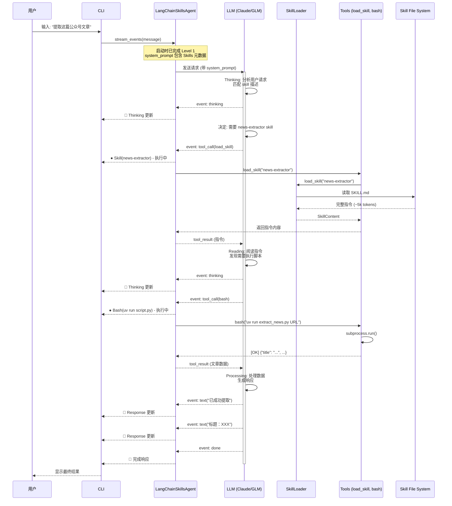
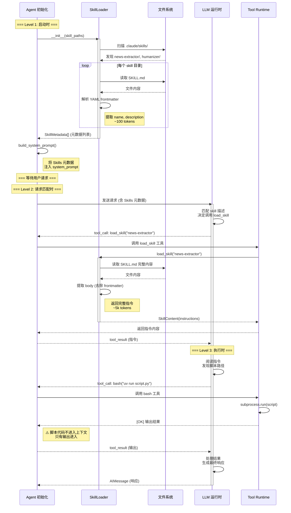
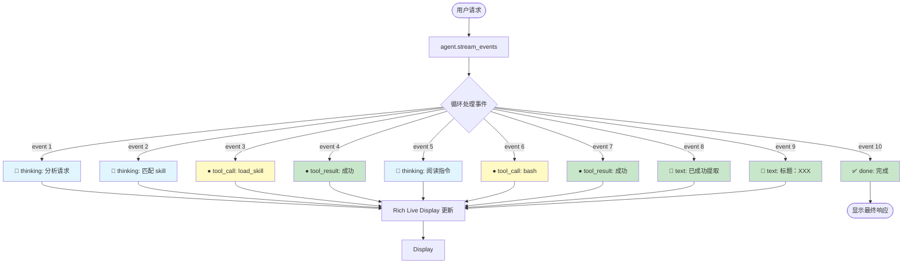
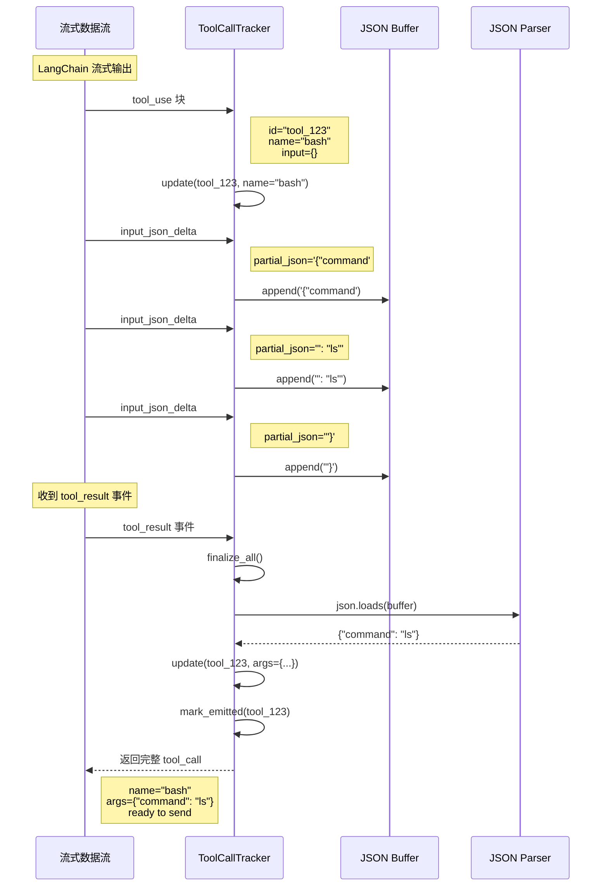
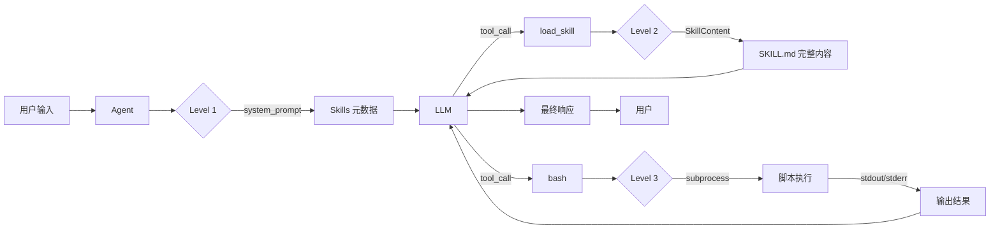
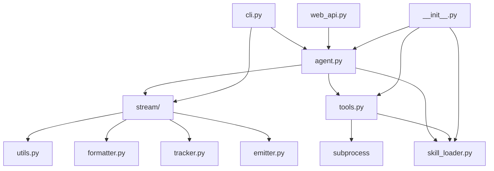
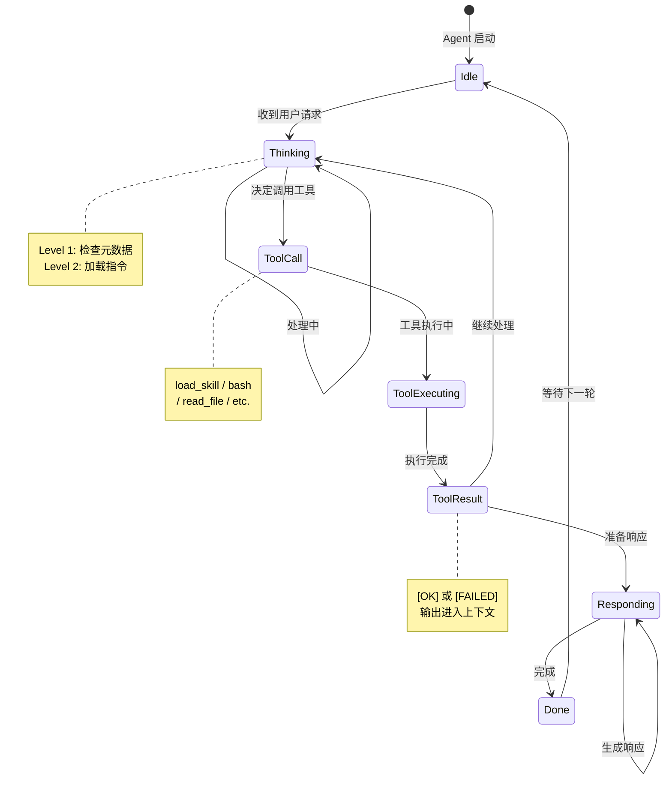
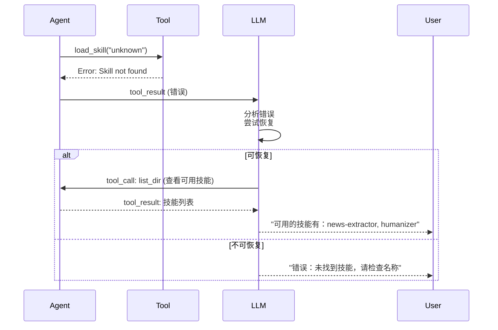

# LangChain Skills Agent 工作流程图

## 1. 完整执行流程图



---

## 2. Skills 三层加载机制时序图



---

## 3. 流式处理事件流图



---

## 4. ToolCallTracker 工作流程



---

## 5. 目录结构映射图

```
.claude/skills/                    (DEFAULT_SKILL_PATHS[0])
│
├── news-extractor/                ← SkillMetadata
│   ├── SKILL.md                   ← YAML frontmatter
│   │   ├── name: news-extractor
│   │   ├── description: 新闻提取...
│   │   └── body (instructions)   ← Level 2 加载内容
│   │
│   ├── scripts/                   ← Level 3 执行
│   │   ├── extract_news.py
│   │   └── crawlers/
│   │
│   ├── references/                (可选)
│   │   └── api_docs.md
│   │
│   └── assets/                    (可选)
│       └── templates/
│
└── humanizer/                     ← SkillMetadata
    ├── SKILL.md
    └── scripts/
        └── humanize.py

~/.claude/skills/                  (DEFAULT_SKILL_PATHS[1])
│
└── custom-skill/                  (用户级兜底)
    └── SKILL.md
```

---

## 6. 数据流图



---

## 7. 模块依赖关系图



---

## 8. 状态机图



---

## 9. 扩展点

```mermaid
graph TD
    A[LangChain Skills Agent] --> B[添加新 Tool]
    A --> C[添加新 Skill]
    A --> D[自定义输出格式]

    B --> B1[@tool 装饰器]
    B1 --> B2[访问 ToolRuntime]

    C --> C1[创建 SKILL.md]
    C1 --> C2[添加 scripts/]

    D --> D1[自定义 StreamEvent]
    D --> D2[自定义 Formatter]
    D --> D3[自定义 CLI Renderer]
```

---

## 10. 错误处理流程



---

## 使用说明

### 查看这些图表

1. **Mermaid Live Editor**: https://mermaid.live/
2. **VS Code**: 安装 Mermaid Preview 插件
3. **GitHub/GitLab**: 直接在 Markdown 中渲染
4. **Obsidian**: 原生支持 Mermaid

### 修改图表

所有图表使用 Mermaid 语法编写，可以直接在文档中修改：

1. 打开 `.md` 文件
2. 找到对应的 ```mermaid 代码块
3. 修改代码
4. 保存即可自动更新

---

**生成时间**: 2026-02-14
**配套文档**: `langchain_skills_architecture_analysis.md`
